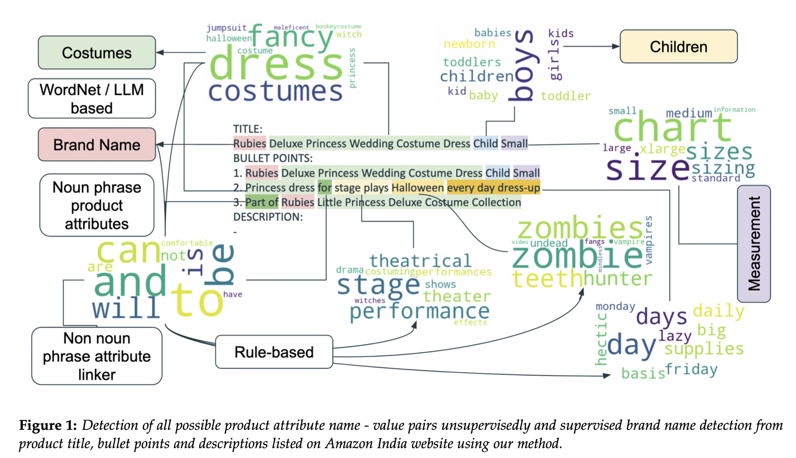

# Amazon India - Product Attribute Extraction
A comprehensive study of the product listing and product attribute extraction on Amazon India e-commerce website. You can check out the slides for the talk [here](https://docs.google.com/presentation/d/e/2PACX-1vQqUh3kelfdDfnvUef36naGv9JHw_PqY7tQqlTMXnqcpBM2VWa1LT114NfFvOG5yiRcNpcOi3r1cvkq/pub?start=false&loop=false&delayms=3000).

  

Noun Attribute Search | Non-Noun Attribute Search
-|-
|

Two fine-tuned models related to this work can be found at the HuggingFace Model Hub:
- [DistilBERT fine-tuned for Amazon India Brand Name Detection](https://huggingface.co/Aleron12/distilbert-base-uncased-finetuned-amz_brander)
- [DistilRoberta fine-tuned on Product Titles, Bullet Points and Descriptions from Amazon India](https://huggingface.co/RishiDarkDevil/distilroberta-base-finetuned-amazon-products)
