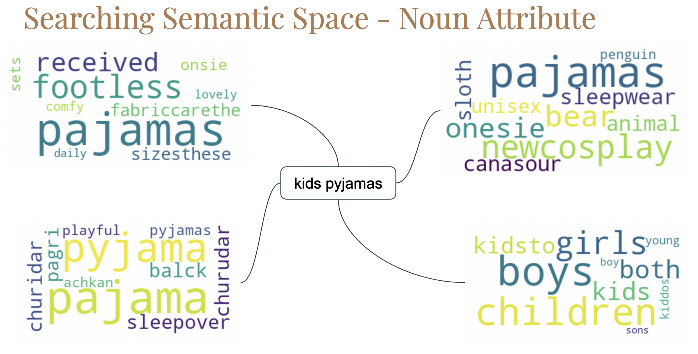
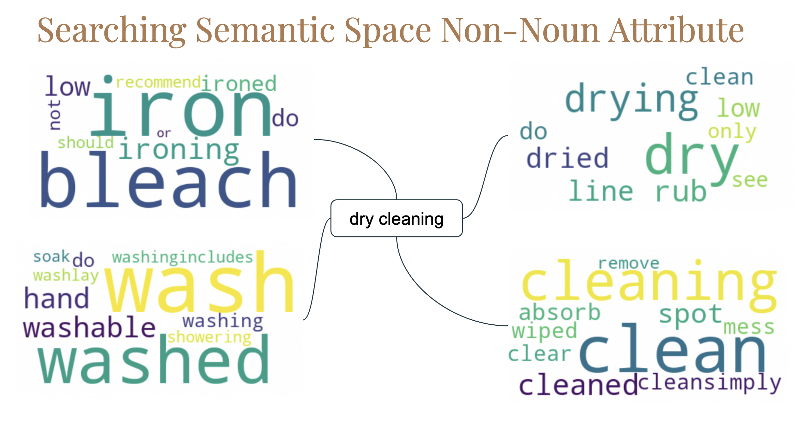
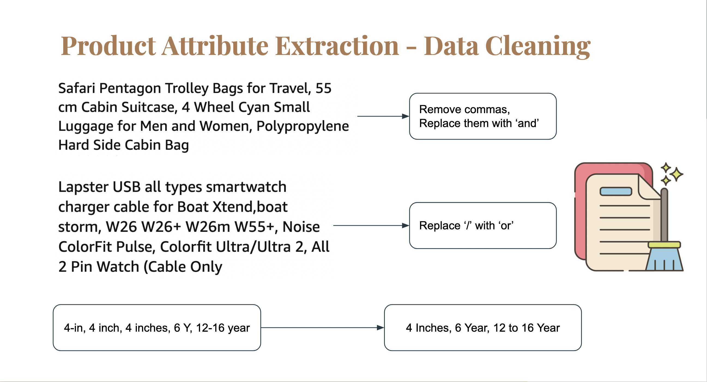
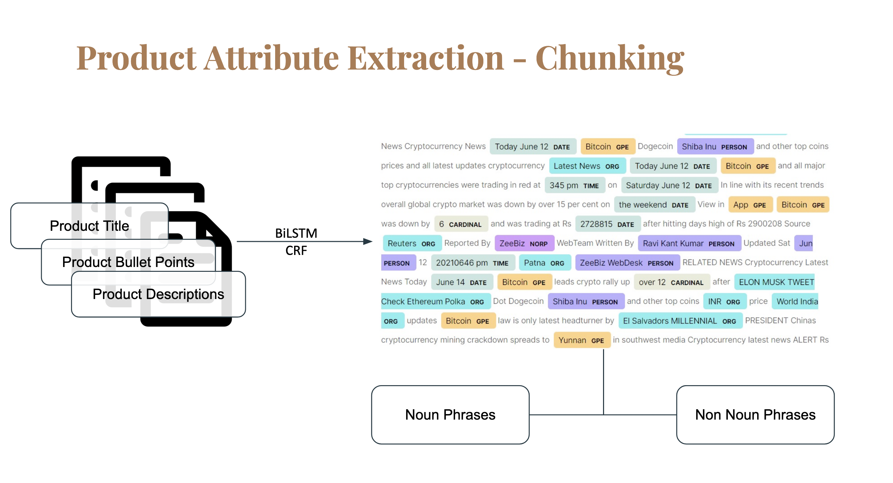
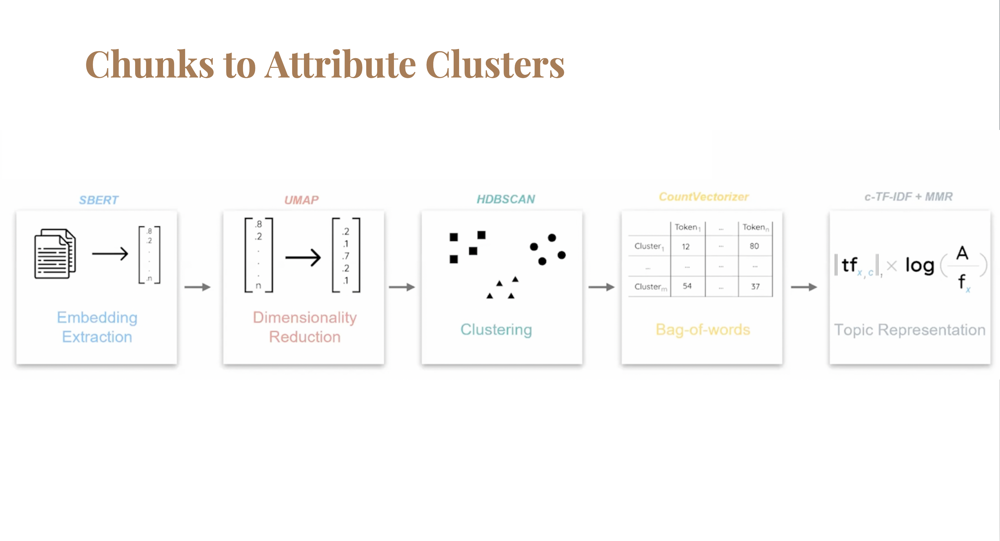
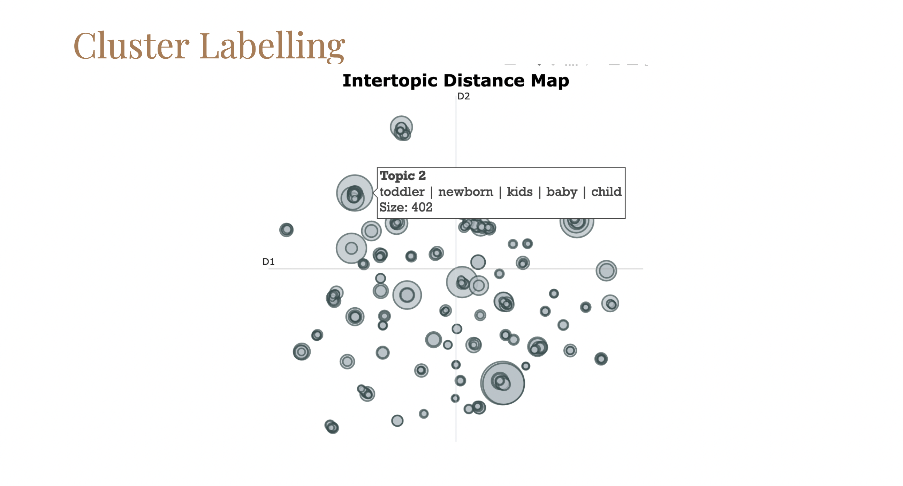

# Amazon India - Product Attribute Extraction
A comprehensive study of the product listing and product attribute extraction on Amazon India e-commerce website. 
- You can check out the slides for the talk [here](https://docs.google.com/presentation/d/e/2PACX-1vQqUh3kelfdDfnvUef36naGv9JHw_PqY7tQqlTMXnqcpBM2VWa1LT114NfFvOG5yiRcNpcOi3r1cvkq/pub?start=false&loop=false&delayms=3000).
- The Paper for this work can be checked out [here](report/Product-Attribute-Extraction-E-Commerce.pdf)

### Method in Action
*Detection of All Possible Product Attribute unsupervisedly and supervised brand name detection using our method on products listed on Amazon India Website is demonstated in the video below*

https://github.com/RishiDarkDevil/Amazon-PAE/assets/52328147/eac61975-cdc7-44e1-ad68-6bf49845012c

Noun Attribute Search | Non-Noun Attribute Search
-|-
|

### Brief Overview of the Methodology

Data Cleaning | Chunking
-|-
|
Product Attribute Clustering | Cluster Labelling
|

Two fine-tuned models related to this work can be found at the HuggingFace Model Hub:
- [DistilBERT fine-tuned for Amazon India Brand Name Detection](https://huggingface.co/Aleron12/distilbert-base-uncased-finetuned-amz_brander)
- [DistilRoberta fine-tuned on Product Titles, Bullet Points and Descriptions from Amazon India](https://huggingface.co/RishiDarkDevil/distilroberta-base-finetuned-amazon-products)
